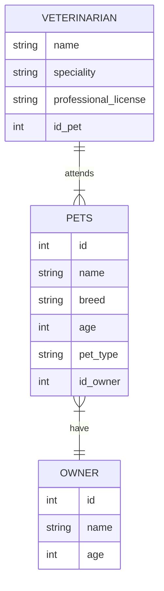

# Veterinary Clinic

## Description
This is my own project about a simple example of a CRUD applied to a Veterinary Clinic. It will contain entities such as pet, owner and veterinarian, with relationships among them. Its purpose is to help me having an introduction to the backend's world. 

## Technologies 
- Front-end: Vue.js 
- Back-end: Node.js

## ER Diagram

